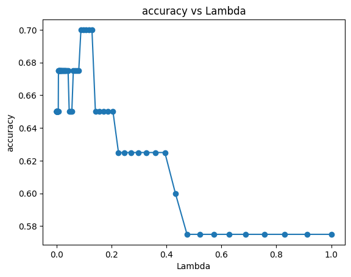
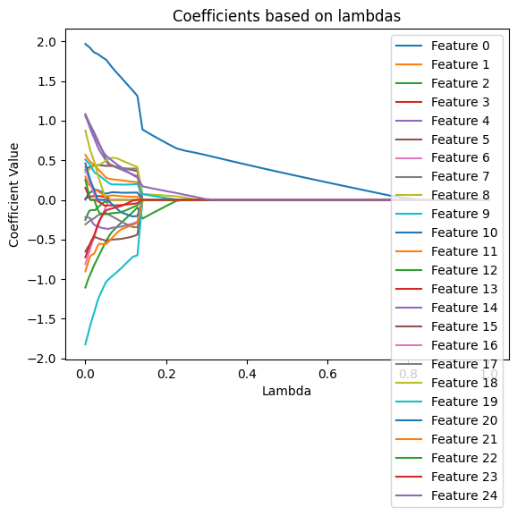

# Project 1 - Advanced Machine Learning

This repository provides an implementation of the Cyclic Coordinate Descent (CCD) algorithm for parameter estimation in regularized logistic regression with an L1 penalty (Lasso).

The implementation of the algorithm can be found in the `logreg_ccd.py` file.

### Example usage
```python
from logreg_ccd import LogRegCCD
import numpy as np

# Initialize the LogRegCCD model
log_reg_ccd = LogRegCCD()

# Fit the model using traning and validation data
log_reg_ccd.fit(
    X_train,
    y_train,
    X_valid,
    y_valid,
    lambdas=np.logspace(-4, 0, 50),
    metric="accuracy"
)

# Predict probabilities for the test data
proba = log_reg_ccd.predict_proba(X_test)

# Calculate the accuracy for the test data
accuracy = log_reg_ccd.validate(X_test, y_test, metric="accuracy")
```

### LogRegCCD initialization parameters

`tol` (tolerance) is a parameter that sets the convergence threshold for the algorithm - the algorithm will stop if the change in parameter values between iterations is smaller than this value.

`max_iter` parameter defines the maximum number of iterations the algorithm will perform, even if convergence is not reached before that.

### Fitting the model

The `fit` method searches through the provided `lambdas` (regularization parameter) values. For each value, it fits the coefficients on the training set. It then evaluates the perfomance based on the metric specified in the `metric` parameter using the validation set. The best lambda is selected based on the highest performance.

### Predicting probabilities

The `predict_proba` method returns the probability of each observation belonging to class 1.

### Validating the model

The `validate` method allows you to calculate the chosen performance metric. The following metrics are supported:

- "recall",
- "accuracy",
- "precision",
- "f1",
- "balanced_accuracy",
- "auc_roc",
- "auc_pr".

### Plotting and Visualization

The `LogRegCCD` class provides methods for visualizing the model's perfomance and coefficient behavior as a function of the regularization parameter.

1. Plotting Metric vs Lambda (method `plot`) <br>
This method plots the specified performance metric against different values of the regularization parameter. The metric is calculated for each value from `lambdas` parameter. Supported metrics are the same as in validation.
<br>


2. Plotting Coefficients vs Lambda (method `plot_coefficients`) <br>
This method visualizes the behavior of the model's coefficients as a function of different values of the regularization parameter.
<br>

